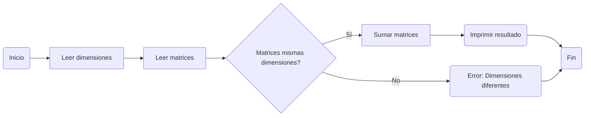
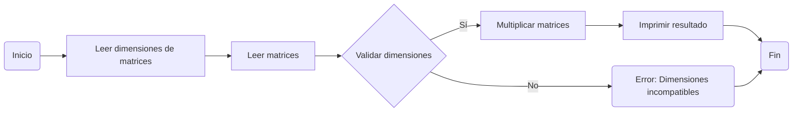
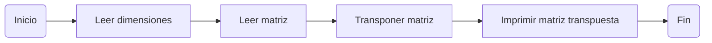
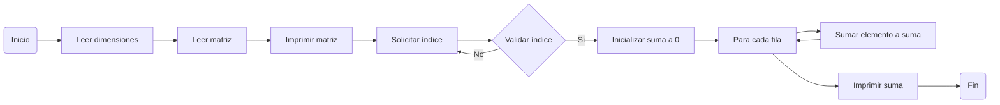
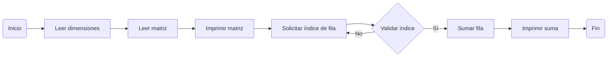

# 11th_repo
##### This is my 11th repo and I don't where I am, but's ok, I do what I can and what I must know at this level

------------

### 1st -> Desarrolle un programa que permita realizar la suma/resta de matrices. El programa debe validar las condiciones necesarias para ejecutar la operación
######  So, I first think what I'm gonna do making a flow chart in mermaid



###### This is the code: 
```python
def leer_matriz(filas, columnas):
    """Lee una matriz de dimensiones filas x columnas desde la entrada estándar.

    Args:
        filas (int): Número de filas de la matriz.
        columnas (int): Número de columnas de la matriz.

    Returns:
        list: La matriz leída, o None si se produjo un error.
    """
    # ... (código original)

def validar_dimensiones(matriz1, matriz2):
    """Valida que dos matrices tengan las mismas dimensiones.

    Args:
        matriz1 (list): Primera matriz.
        matriz2 (list): Segunda matriz.

    Returns:
        bool: True si las dimensiones son iguales, False en caso contrario.
    """
    return len(matriz1) == len(matriz2) and len(matriz1[0]) == len(matriz2[0])

def mostrar_menu():
    """Muestra un menú de opciones al usuario."""
    print("Operaciones con matrices")
    print("1. Sumar matrices")
    print("2. Restar matrices")
    # ... (agregar más opciones)
    return int(input("Seleccione una opción: "))

def main():
    """Función principal del programa."""
    while True:
        opcion = mostrar_menu()

        if opcion == 1:
            # ... (código para sumar matrices)
        elif opcion == 2:
            # ... (código para restar matrices)
        # ... (agregar más casos para otras opciones)
        else:
            print("Opción inválida.")

if __name__ == "__main__":
    main()
```


### 2nd -> Desarrolle un programa que permita realizar el producto de matrices. El programa debe validar las condiciones necesarias para ejecutar la operación
######  So, I first think what I'm gonna do making a flow chart in mermaid



###### This is the code: 
```python
def validar_dimensiones(matriz1, matriz2):
    """Verifica si las dimensiones de dos matrices son compatibles para la multiplicación.

    Args:
        matriz1 (list): Primera matriz.
        matriz2 (list): Segunda matriz.

    Returns:
        bool: True si las dimensiones son compatibles, False en caso contrario.
    """
    return len(matriz1[0]) == len(matriz2)

def producto_escalar(fila1, columna2):
    """Calcula el producto escalar de una fila y una columna.

    Args:
        fila1 (list): Fila de la primera matriz.
        columna2 (list): Columna de la segunda matriz.

    Returns:
        int: Producto escalar.
    """
    return sum(x * y for x, y in zip(fila1, columna2))

def multiplicar_matrices(matriz1, matriz2):
    # ... (código original con las modificaciones)

def main():
    # ... (código original)

if __name__ == "__main__":
    main()
```


### 3rd -> Desarrolle un programa que permita obtener la matriz transpuesta de una matriz ingresada. El programa debe validar las condiciones necesarias para ejecutar la operación
######  So, I first think what I'm gonna do making a flow chart in mermaid



###### This is the code: 

```python
def leer_matriz(filas, columnas):
    """
    Lee una matriz del usuario, validando que cada fila tenga el número correcto de columnas.
    """
    matriz = []
    print(f"Ingrese los elementos de la matriz {filas}x{columnas}:")
    for i in range(filas):
        while True:
            try:
                fila = list(map(int, input(f"Fila {i+1} (separada por espacios): ").split()))
                if len(fila) != columnas:
                    print(f"Error: La fila debe tener {columnas} elementos. Inténtalo de nuevo.")
                    continue
                matriz.append(fila)
                break
            except ValueError:
                print("Error: Entrada inválida. Asegúrate de ingresar números separados por espacios.")
    return matriz

def imprimir_matriz(matriz):
    """
    Imprime una matriz de manera legible.
    """
    for fila in matriz:
        print(" ".join(map(str, fila)))

def transponer_matriz(matriz):
    """
    Calcula la matriz transpuesta.
    """
    filas = len(matriz)
    columnas = len(matriz[0])
    matriz_transpuesta = [[0] * filas for _ in range(columnas)]
    for i in range(filas):
        for j in range(columnas):
            matriz_transpuesta[j][i] = matriz[i][j]
    return matriz_transpuesta

def main():
    print("Transposición de matrices")

    filas = int(input("Ingrese el número de filas de la matriz: "))
    columnas = int(input("Ingrese el número de columnas de la matriz: "))

    print("Ingrese la matriz:")
    matriz = leer_matriz(filas, columnas)

    print("\nMatriz ingresada:")
    imprimir_matriz(matriz)

    print("\nMatriz transpuesta:")
    matriz_transpuesta = transponer_matriz(matriz)
    imprimir_matriz(matriz_transpuesta)

if __name__ == "__main__":
    main()
```

### 4th -> Desarrollar un programa que sume los elementos de una columna dada de una matriz
######  So, I first think what I'm gonna do making a flow chart in mermaid



###### This is the code: 
```python
def leer_matriz(filas, columnas):
    """
    Lee una matriz del usuario, validando que cada fila tenga el número correcto de columnas.
    """
    matriz = []
    print(f"Ingrese los elementos de la matriz {filas}x{columnas}:")
    for i in range(filas):
        while True:
            try:
                fila = list(map(int, input(f"Fila {i+1} (separada por espacios): ").split()))
                if len(fila) != columnas:
                    print(f"Error: La fila debe tener {columnas} elementos. Inténtalo de nuevo.")
                    continue
                matriz.append(fila)
                break
            except ValueError:
                print("Error: Entrada inválida. Asegúrate de ingresar números separados por espacios.")
    return matriz

def imprimir_matriz(matriz):
    """
    Imprime una matriz de manera legible.
    """
    for fila in matriz:
        print(" ".join(map(str, fila)))

def sumar_columna(matriz, columna_index):
    """
    Suma los elementos de la columna especificada.
    """
    filas = len(matriz)
    suma = 0
    for i in range(filas):
        if columna_index < len(matriz[i]):
            suma += matriz[i][columna_index]
        else:
            print(f"Error: El índice de columna {columna_index} está fuera del rango.")
            return None
    return suma

def main():
    print("Suma de elementos de una columna de una matriz")

    filas = int(input("Ingrese el número de filas de la matriz: "))
    columnas = int(input("Ingrese el número de columnas de la matriz: "))

    print("Ingrese la matriz:")
    matriz = leer_matriz(filas, columnas)

    print("\nMatriz ingresada:")
    imprimir_matriz(matriz)

    while True:
        try:
            columna_index = int(input(f"\nIngrese el índice de la columna a sumar (0 a {columnas - 1}): "))
            if 0 <= columna_index < columnas:
                break
            else:
                print(f"Error: El índice debe estar entre 0 y {columnas - 1}. Inténtalo de nuevo.")
        except ValueError:
            print("Error: Entrada inválida. Asegúrate de ingresar un número entero.")

    suma = sumar_columna(matriz, columna_index)
    if suma is not None:
        print(f"\nLa suma de los elementos de la columna {columna_index} es: {suma}")

if __name__ == "__main__":
    main()
```

### 5th -> Desarrollar un programa que sume los elementos de una fila dada de una matriz
######  So, I first think what I'm gonna do making a flow chart in mermaid



###### This is the code: 
```python
def leer_matriz(filas, columnas):
    """
    Lee una matriz del usuario, validando que cada fila tenga el número correcto de columnas.
    """
    # ... (código ya proporcionado)

def imprimir_matriz(matriz):
    """
    Imprime una matriz de manera legible.
    """
    # ... (código ya proporcionado)

def sumar_fila(matriz, fila_index):
    """
    Suma los elementos de una fila específica.
    """
    if fila_index < 0 or fila_index >= len(matriz):
        print(f"Error: El índice de fila {fila_index} está fuera del rango.")
        return None
    
    suma = sum(matriz[fila_index])
    return suma

def main():
    print("Suma de elementos de una fila de una matriz")
    
    # ... (código ya proporcionado)

if __name__ == "__main__":
    main()
```
