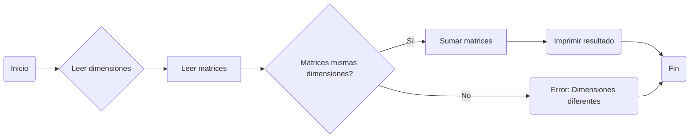

# 11th_repo
##### This is my 11th repo and I don't where I am, but's ok, I do what I can and what I must know at this level

------------

### 1st -> Desarrolle un programa que permita realizar la suma/resta de matrices. El programa debe validar las condiciones necesarias para ejecutar la operación
######  So, I first think what I'm gonna do making a flow chart in mermaid

######This is the code: 
    def leer_matriz(filas, columnas):
        """Lee una matriz de dimensiones filas x columnas desde la entrada estándar.
    
        Args:
            filas (int): Número de filas de la matriz.
            columnas (int): Número de columnas de la matriz.
    
        Returns:
            list: La matriz leída, o None si se produjo un error.
        """
        # ... (código original)
    
    def validar_dimensiones(matriz1, matriz2):
        """Valida que dos matrices tengan las mismas dimensiones.
    
        Args:
            matriz1 (list): Primera matriz.
            matriz2 (list): Segunda matriz.
    
        Returns:
            bool: True si las dimensiones son iguales, False en caso contrario.
        """
        return len(matriz1) == len(matriz2) and len(matriz1[0]) == len(matriz2[0])
    
    def mostrar_menu():
        """Muestra un menú de opciones al usuario."""
        print("Operaciones con matrices")
        print("1. Sumar matrices")
        print("2. Restar matrices")
        # ... (agregar más opciones)
        return int(input("Seleccione una opción: "))
    
    def main():
        """Función principal del programa."""
        while True:
            opcion = mostrar_menu()
    
            if opcion == 1:
                # ... (código para sumar matrices)
            elif opcion == 2:
                # ... (código para restar matrices)
            # ... (agregar más casos para otras opciones)
            else:
                print("Opción inválida.")
    
    if __name__ == "__main__":
        main()`
